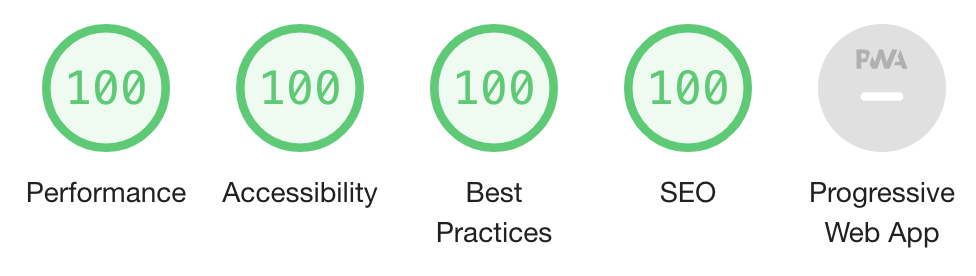

# PingCRM on Rails

A demo application built with Ruby on Rails and Vue.js 3 to illustrate how **[Inertia.js](https://inertiajs.com/)** works.


This is a port of the [original PingCRM written in Laravel/PHP](https://github.com/inertiajs/pingcrm) to Ruby on Rails. Now it's possible to dive into the beautiful world of **Inertia.js** without having to install PHP ;-)

There is a hosted installation of this demo available at https://pingcrm.ledermann.dev. Login with:

- **Username:** johndoe@example.com
- **Password:** secret

## Lighthouse performance audit



## Installation

Clone the repo locally:

```
git clone https://github.com/ledermann/pingcrm.git
```

Setup (install dependencies, create and seed database):

```
cd pingcrm
bin/setup
```

Start it:

```
bin/dev
```

You're ready to go! Visit PingCRM in your browser (http://localhost:3000), and login with:

- **Username:** johndoe@example.com
- **Password:** secret

## Running tests

To run the PingCRM tests, run:

```
rails test:system
```

## Requirements

- Ruby 3.1
- Ruby on Rails 7
- PostgreSQL

## Credits

- Original work by Jonathan Reinink (@reinink) and contributors
- Port to Ruby on Rails by Georg Ledermann (@ledermann)
